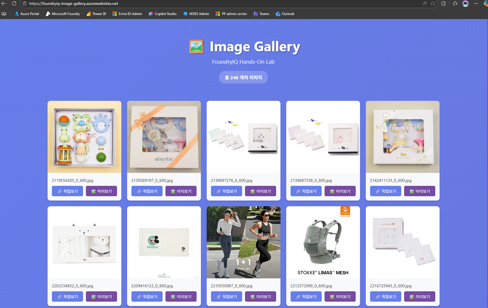

# 📦 샘플 데이터셋

## � 이 폴더에서 얻어갈 수 있는 것

이 폴더의 샘플 데이터를 통해 다음을 학습할 수 있습니다:

| 학습 항목 | 설명 |
|----------|------|
| **🔍 실제 이커머스 데이터 구조 이해** | Azure AI Search에 적합한 필드 타입(String, Int32 등)과 데이터 형식을 파악합니다 |
| **📊 검색 시나리오 설계** | 11개 카테고리, 다양한 브랜드로 필터링/정렬/집계 시나리오를 구상할 수 있습니다 |
| **🇰🇷 한국어 검색 특성 파악** | 한글 제품명, 브랜드명으로 형태소 분석기(`ko.lucene`)의 동작을 이해합니다 |
| **🧮 벡터 검색 테스트 설계** | 제품 설명/리뷰 텍스트로 의미 기반 검색 테스트 케이스를 만들 수 있습니다 |
| **💰 비즈니스 필터 구현** | 가격대별 정렬, 카테고리 필터 등 실무 요구사항을 데이터와 연결합니다 |

---

## �🌐 이미지 갤러리 웹사이트

샘플 이미지들은 아래 웹사이트에서 확인할 수 있습니다:
> Azure 클라우드에서 핸즈온을 할 때만 Running 하는 웹사이트 입니다. 평소에는 접속이 안 될 수 있어요!

🔗 **[FoundryIQ Image Gallery](https://foundryiq-image-gallery.azurewebsites.net/)**

</br>



---

## 📊 데이터셋 정보

샘플 데이터는 `sample_data.csv` 파일에서 제공됩니다.

### 데이터 구조

| 컬럼명 | 설명 | 예시 |
|--------|------|------|
| `title` | 상품명 | 압소바6 레코딸랑이세트 |
| `brand` | 브랜드명 | 압소바, 젝시믹스, 노스페이스 등 |
| `category` | 상품 카테고리 | 유아동, 스포츠/레져, 패션의류 등 |
| `normal_price` | 정상 가격 (원) | 39000 |
| `image_link` | 상품 이미지 URL | https://foundryiq-image-gallery.azurewebsites.net/images/xxx.jpg |

### 카테고리 분포

| 카테고리 | 설명 |
|----------|------|
| 🧒 **유아동** | 출산용품, 아기용품, 완구 등 |
| 🏃 **스포츠/레져** | 운동복, 러닝화, 캠핑용품 등 |
| 👗 **패션의류** | 셔츠, 스웨터, 자켓 등 |
| 👜 **패션잡화** | 가방, 신발, 모자, 시계 등 |
| 💄 **이미용** | 화장품, 향수, 스킨케어 등 |
| 🏠 **인테리어** | 홈데코, 가구 등 |
| 🍽️ **주방** | 식기, 주방용품 등 |
| 💎 **보석/장신구** | 귀걸이, 목걸이, 반지 등 |
| 🐾 **문화/취미** | 반려동물용품 등 |
| 👙 **언더웨어** | 속옷, 홈웨어 등 |
| 🧴 **생활/건강** | 생활용품 등 |

### 주요 브랜드

- **유아동**: 압소바, 블루독베이비, 밍크뮤, 에뜨와, 스토케 등
- **스포츠**: 젝시믹스, 노스페이스, 파타고니아, 디스커버리, 아디다스, 나이키 등
- **패션**: 라코스테, 타미힐피거, 앤더슨벨, 폴로 랄프 로렌 등
- **뷰티**: 샤넬, 디올, 이솝, 설화수, 크리드 등
- **명품**: 메종 마르지엘라, 롱샴, 막스마라 등

### 데이터셋 통계

- **총 상품 수**: 약 220개
- **가격 범위**: ₩16,240 ~ ₩6,400,000
- **이미지 형식**: JPG (600px)

---

## 🚀 사용 방법

1. `sample_products.csv` 파일을 로드합니다
2. Azure AI Search 인덱스에 데이터를 업로드합니다
3. 이미지 URL을 통해 벡터 임베딩을 생성합니다
4. 검색 쿼리를 실행합니다

```python
import pandas as pd

# 데이터 로드
df = pd.read_csv('sample_data.csv')

# 데이터 확인
print(df.head())
print(f"총 상품 수: {len(df)}")
```
