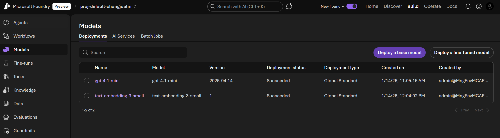

# Azure Portal을 통한 환경 설정

## 🎯 이 폴더에서 얻어갈 수 있는 것

이 실습을 완료하면 다음을 할 수 있게 됩니다:

| 학습 항목 | 설명 |
|----------|------|
| **☁️ Azure AI Search 서비스 프로비저닝** | Azure Portal에서 검색 서비스를 생성하고 SKU(Free/Basic/Standard)별 차이점을 이해합니다 |
| **🤖 Azure AI Foundry 프로젝트 구성** | AI Foundry에서 프로젝트를 만들고 LLM 모델(GPT-4.1-mini, text-embedding-3-small)을 배포합니다 |
| **🔑 서비스 연결 및 인증** | API Key, Endpoint를 활용한 Azure 서비스 연결 방법을 익힙니다 |
| **🐍 Python 개발 환경 구축** | 가상환경 생성, 필수 패키지 설치(`azure-search-documents`, `openai` SDK)를 수행합니다 |
| **✅ 연결 테스트** | `.env` 파일 구성과 각 서비스 연결 검증을 통해 실습 환경을 완성합니다 |

### 📓 노트북 학습 내용

**[test_connection.ipynb](./test_connection.ipynb)**
- Azure AI Search 연결 상태 확인
- OpenAI Embedding 모델 동작 테스트
- OpenAI Chat 모델 응답 확인
- 환경 변수 로딩 및 검증

---

Azure AI Search를 사용하기 위한 초기 환경을 설정합니다.

## 1.Azure 리소스 그룹 생성
1. **Azure Portal** (https://portal.azure.com) 접속
2. **"리소스 만들기"** 클릭
3. **"Resource Group"** 검색 후 선택
4. 다음 정보 입력:
   - **구독**: 본인의 Azure 구독 선택
   - **리소스 그룹명**: rg-aisearch-<날짜>-<이름>
     - 예: `rg-aisearch-260114-changjuahn`
    - **위치**: `Korea Central` 권장
5. **"검토 + 만들기"** → **"만들기"** 클릭

</br>

## 2. Azure AI Search 서비스 생성
1. **Azure Portal** (https://portal.azure.com) 접속
2. **"리소스 만들기"** 클릭
3. **"Azure AI Search"** 검색 후 선택
4. 다음 정보 입력:
   - **구독**: 본인의 Azure 구독 선택
   - **리소스 그룹**: 위에서 만든 리소스 그룹 선택
     - 예: `rg-aisearch-260114-changjuahn`
   - **서비스 이름**: `foundryiq-aisearch-<날짜>-<이름>`
     - 예: `foundryiq-aisearch-260114-changjuahn`
   - **위치**: `Korea Central` 권장
   - **가격 책정 계층**:
     - 학습용: `Free` (제한: 인덱스 3개, 50MB)
     - 실습용: `Basic` (인덱스 15개, 2GB): **여기서는 이 SKU로 실습**
     - 프로덕션: `Standard` 이상
5. **"검토 + 만들기"** → **"만들기"** 클릭

#### 필요한 정보 기록
생성 완료 후 다음 정보를 기록해두세요:
- **서비스 이름**: `foundryiq-search-dev`
- **엔드포인트**: `https://foundryiq-search-dev.search.windows.net`
- **관리 키** (Admin Key):
  - 리소스 → 설정 → 키 → 기본 관리 키 복사

</br>

## 3. Microsoft Foundry 생성
1. **"리소스 만들기"** → **"Microsoft Foundry"** 검색
2. 다음 정보 입력:
   - **구독**: Azure 구독 선택
   - **리소스 그룹**: 위에서 만든 리소스 그룹 선택
     - 예: `rg-aisearch-260114-changjuahn`
   - **지역**: `East US` 또는 `Sweden Central` (모델 가용성 확인)
   - **이름**: `foundryiq-openai-dev-<날짜>-<이름>`
     - 예: `foundryiq-openai-dev-260114-changjuahn`
    - **기본 프로젝트**: `proj-default-<이름>`
     - 예: `proj-default-changjuahn`
3. **"검토 + 만들기"** → **"만들기"** 클릭

</br>

## 4. LLM 모델 배포
1. Microsoft Foundry (https://ai.azure.com/) 접속
2. 작업 전 방금 만든 프로젝트로 이동
3. **"Build"** 메뉴 이동 후 **"Models"** 탭 이동
4. 우측 상단의 **"Deploy a base model"** 을 통해 두 개의 모델 배포
   - **모델**: `GPT-4.1-mini`, 그리고 `text-embedding-3-small`
   - **설정**: 모든 설정은 Default


#### 필요한 정보 기록
- **프로젝트 엔드포인트**: `https://foundryiq-openai-dev-260114-changjuahn.services.ai.azure.com/api/projects/proj-default-changjuahn`
- **키**: API Key

---

# Python 환경 구성

## 1 Python 설치 확인

```bash
python --version
# Python 3.9 이상 필요
```

## 2 가상환경 생성

```bash
# 프로젝트 루트로 이동
cd AzureAISearch_FoundryIQ_HandsOn

# 가상환경 생성
python -m venv .venv

# 가상환경 활성화
# Windows PowerShell
.\.venv\Scripts\Activate.ps1

# Windows CMD
.\.venv\Scripts\activate.bat

# Mac/Linux
source .venv/bin/activate
```

## 3. 필수 라이브러리 설치

```bash
pip install -r requirements.txt
```

**requirements.txt 내용:**
```txt
# Azure SDK
azure-search-documents>=11.4.0
azure-identity>=1.15.0
azure-storage-blob>=12.19.0

# Azure OpenAI
openai>=1.12.0

# 데이터 처리 (바이너리 휠 사용)
pandas>=2.0.0
numpy>=1.24.0

# 유틸리티
python-dotenv>=1.0.0
requests>=2.31.0
pillow>=10.0.0
```

**⚠️ Windows에서 설치 오류 발생 시:**

Windows에서 pandas/numpy 설치 시 C 컴파일러 오류가 발생하면:

1. **먼저 pip와 setuptools 업그레이드:**
   ```bash
   python -m pip install --upgrade pip setuptools wheel
   ```

2. **다시 설치:**
   ```bash
   pip install -r requirements.txt
   ```

3. **여전히 오류 발생 시, 개별 설치:**
   ```bash
   pip install azure-search-documents azure-identity azure-storage-blob
   pip install openai
   pip install python-dotenv requests pillow
   pip install pandas  # 최신 버전은 바이너리 휠 제공
   ```

---

## 4. 환경 변수 설정
프로젝트 루트에 `.env` 파일을 생성하고 내용을 입력합니다:

```
# Azure AI Search 설정
SEARCH_ENDPOINT=https://<your-search-service-name>.search.windows.net
SEARCH_ADMIN_KEY=<your_key_here>
SEARCH_INDEX_NAME=products-index

# Azure OpenAI (Foundry 프로젝트)
# 프로젝트 엔드포인트 하나로 모든 deployment 접근 가능
AZURE_OPEN_AI_ENDPOINT=https://<your-search-service-name>.openai.azure.com/
AZURE_OPEN_AI_KEY=<your_key_here>
AZURE_OPENAI_EMBEDDING_DEPLOYMENT=text-embedding-3-small
AZURE_OPENAI_CHAT_DEPLOYMENT=gpt-4.1-mini
AZURE_OPENAI_API_VERSION=2024-02-01
```

---

## 4. 연결 테스트

### 4.1 테스트 노트북 실행

[test_connection.ipynb](./test_connection.ipynb) 노트북을 열어 Azure 리소스 연결을 테스트하세요.

이 노트북에서는 다음 항목을 검증합니다:
- Azure AI Search 연결 상태
- Azure OpenAI Embedding 모델 (text-embedding-3-small)
- Azure OpenAI Chat 모델 (gpt-4.1-mini)

---

## ✅ 체크리스트

환경 설정이 완료되었는지 확인하세요:

- [ ] Azure AI Search 서비스 생성 완료
- [ ] Azure OpenAI 서비스 생성 및 모델 배포 완료
- [ ] Python 가상환경 생성 및 활성화
- [ ] 필수 라이브러리 설치 완료
- [ ] .env 파일 생성 및 키 입력 완료
- [ ] 연결 테스트 성공

---

## 🚀 다음 단계

환경 설정이 완료되었다면 [02-indexing](../02-indexing)으로 이동하여 Index와 Indexer를 구성하세요.

## 🆘 문제 해결

### Q1: Azure AI Search 생성 시 "이름을 사용할 수 없습니다" 오류
**A**: 서비스 이름은 전역적으로 고유해야 합니다. 다른 이름을 시도하세요.

### Q2: OpenAI 임베딩 모델을 찾을 수 없음
**A**: 지역에 따라 사용 가능한 모델이 다릅니다. East US나 Sweden Central을 사용하세요.

### Q3: pip install 시 pandas/numpy 빌드 오류 (Windows)
**A**: C 컴파일러가 없어서 발생하는 문제입니다. 다음 해결 방법을 시도하세요:

**방법 1: pip 업그레이드 후 재설치**
```bash
python -m pip install --upgrade pip setuptools wheel
pip install --no-cache-dir -r requirements.txt
```

**방법 2: 최신 버전 사용 (바이너리 휠 포함)**
```bash
pip install pandas --no-build-isolation
```

**방법 3: 개별 패키지 설치**
```bash
pip install azure-search-documents azure-identity openai python-dotenv requests pillow pandas
```

### Q4: 연결 테스트 실패
**A**: .env 파일의 키와 엔드포인트가 정확한지 확인하고, 키에 공백이 없는지 확인하세요.

### Q3: 연결 테스트 실패
**A**: .env 파일의 키와 엔드포인트가 정확한지 확인하고, 키에 공백이 없는지 확인하세요.
